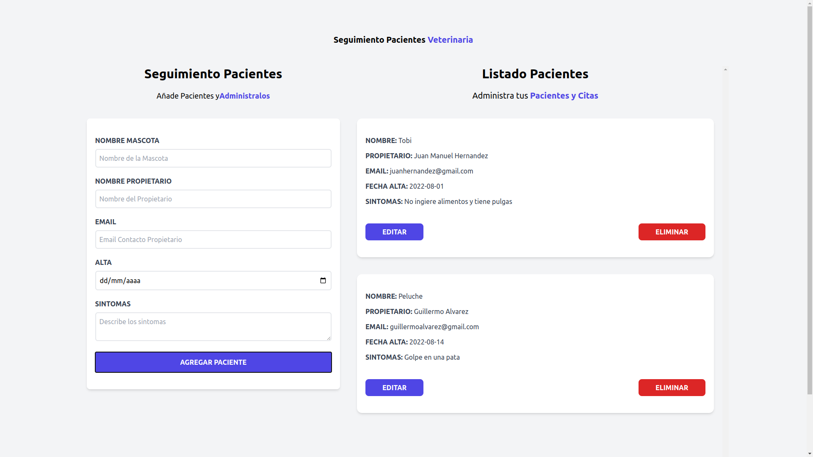

# Título del Proyecto

Administrador de Pacientes de Veterinaria

## Description

Aplicación desarrollada con React para realizar operaciones CRUD sobre pacientes.
Utiliza Tailwind para los estilos.
Funcionalidades:
1-Agregar paciente.
2-Validar paciente.
3-Los pacientes agregados persisten en el localstorage.
4-Eliminar pacientes.
5-Editar pacientes.
6-Se utiliza el mismo formulario para agregar y editar pacientes.

## Getting Started

### Dependencies

react: ^17.0.2
react-dom: ^17.0.2

### Installing

- npm install

### Executing program

- npm run dev

## Authors

- Eduardo Daniel Viana
- Email: eduardoviana83@gmail.com
